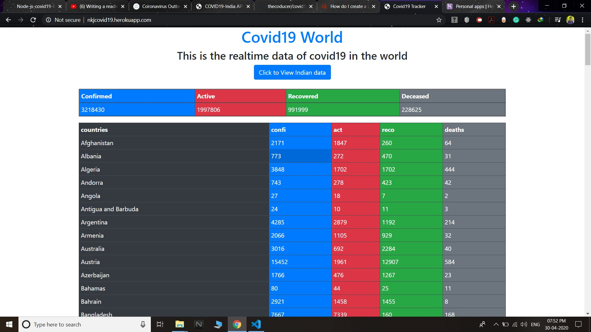
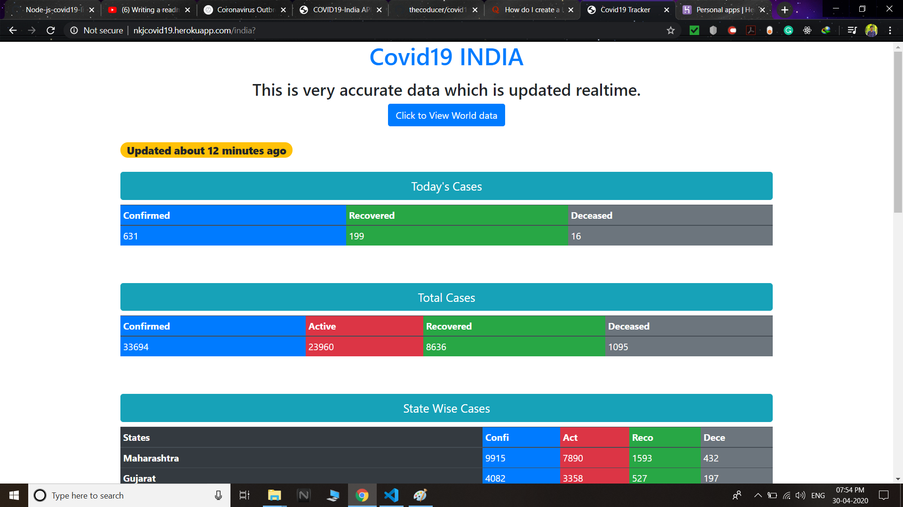

# Node-js-covid19-India-world-data

## Description
This project contains covid19 data of both world as well as India. For the live demo visit http://nkjcovid19.herokuapp.com

---

## Objective

- Learn the Node js runtime environment
- Learn about APIs and how they work
- Create my own REST API
- Parse JSONs in Node js
- Enhance practical knowledge of Node js

---

## Built with

- <a href="nodejs.org">Node js</a> -The run time environment.
- <a href="https://www.npmjs.com/package/axios">Axios</a> -Used to request the covid19 api.
- <a href="https://www.npmjs.com/package/express">Express js</a> -Used to create the server and get the route.
- <a href="https://www.npmjs.com/package/ejs">EJS</a> -Templating engine.
- <a href="https://www.npmjs.com/package/express-ejs-layouts">express-ejs-layouts</a> -Used to connect templates.
- <a href="https://www.npmjs.com/package/moment-timezone">moment-timezone</a> -Used to get present time.
- <a href="https://getbootstrap.com/">Bootstrap</a> -To make web page look better

---

## Hosted on

- <a href="https://heroku.com">Heroku</a>

---

## App is live at

- http://nkjcovid19.herokuapp.com

---

## Screenshots

### World data

### Indian data

---

## Data sources

### Indian data api

<table>
  <tr>
    <th>Data</th>
    <th>URL</th>
  </tr>
  <tr>
    <td>National Level :Time series, State-wise stats and Test counts</td>
    <td>	https://api.covid19india.org/data.json</td>
  </tr>
  </table>
  
### World data api
  
<table>
  <tr>
    <th>Data</th>
    <th>URL</th>
  </tr>
  <tr>
    <td>The main api of the covid19 world database</td>
    <td>	https://covid19.mathdro.id/api</td>
  </tr>
  </table>
  
  ---
  
  ## Special thanks
  
  - My special thanks to covid19india <@nithinkjoy-tech> for inspiring me to make this project and providing the links of api.

## License

The license for this software is open source, you can reuse this code because this code is for humanity.
